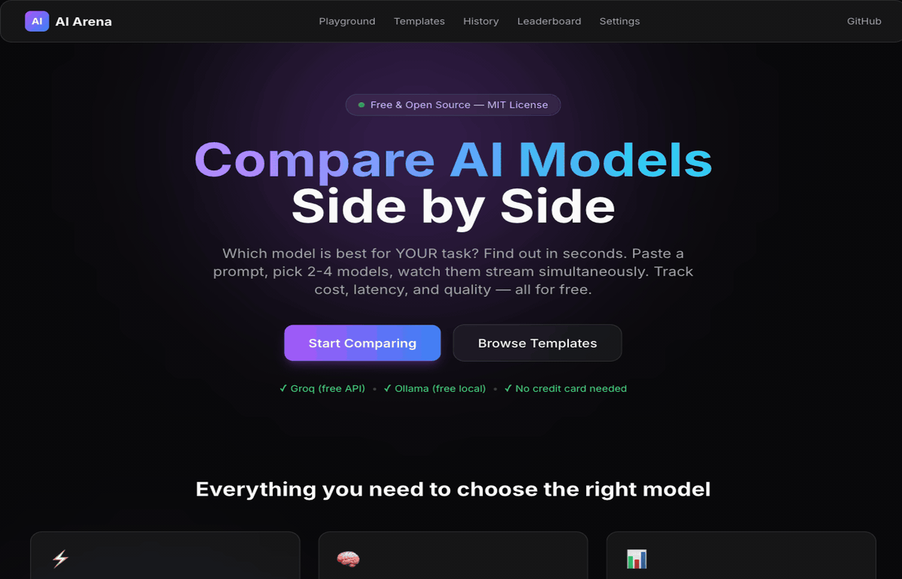

# AI Arena Playground




[](https://opensource.org/licenses/MIT) [](https://www.typescriptlang.org/)

## What is this?

AI Arena Playground lets you compare multiple LLMs side-by-side in real time. It's a free, open-source, self-hosted tool that streams responses from 2-4 models simultaneously and tracks cost, latency, and token usage per response.

## Screenshot

*Add a screenshot of the Playground UI here.*

## Features

- Side-by-side streaming comparison (2-4 models simultaneously)
- Real-time cost per response tracking (exact $ amount)
- Latency measurement for each model (ms precision)
- Token counting for prompts and responses
- Persistent comparison history with full-text search
- Model leaderboard (fastest, cheapest, most used — from YOUR data)
- 32 ready-made prompt templates in 6 categories
- Glassmorphism dark UI built with TailwindCSS
- No authentication required — personal tool out of the box
- Free usage with Groq + Ollama (no API charges, no credit card)

## Supported Models

| Provider | Models | Free? |
|----------|--------|-------|
| **Groq** | Llama 3.3 70B, Llama 3.1 8B | Yes (free tier) |
| **Ollama** | Any locally installed model | Yes (local) |
| **OpenAI** | GPT-4o, GPT-4o Mini | No (your API key) |
| **Anthropic** | Claude Sonnet 4, Claude Haiku 3.5 | No (your API key) |
| **Google** | Gemini 2.5 Flash, Gemini 2.0 Flash | No (your API key) |
| **Mistral** | Mistral Large, Mistral Small | No (your API key) |

Start with Groq + Ollama for a completely free experience. Add paid providers as needed.

## Quick Start

```bash
# 1. Clone
git clone https://github.com/enzoemir1/ai-arena-playground.git
cd ai-arena-playground

# 2. Install + setup (creates .env from template, pushes DB schema, seeds defaults)
npm install && npm run setup

# 3. Add one free API key
# Edit .env → paste your GROQ_API_KEY (get free at https://console.groq.com)

# 4. Start
npm run dev

# 5. Open http://localhost:3000 → go to /playground → compare!
```

## Pages

| Route | Description |
|-------|-------------|
| `/` | Landing page — overview, features, supported models |
| `/playground` | Main comparison UI (select 2-4 models, enter prompt, stream) |
| `/templates` | Browse 32 prompt templates by category |
| `/history` | Searchable list of past comparisons with full responses |
| `/leaderboard` | Auto-generated rankings (fastest, cheapest, most used) |
| `/settings` | API key setup guide, model pricing reference |

## Prompt Templates

| Category | Count | Examples |
|----------|-------|---------|
| **Code** | 10 | Debug, Refactor, Explain, Unit Test, SQL, API Design, Code Review, Regex, Algorithm, Docs |
| **Writing** | 8 | Blog Post, Email, Cover Letter, Product Description, Social Media, Story, Summary, Translate |
| **Analysis** | 6 | Data Analysis, Compare Options, Pros/Cons, Research, SWOT, Market Analysis |
| **Creative** | 4 | Brainstorm, Tagline, Name Generator, Analogy |
| **Education** | 4 | ELI5, Study Guide, Quiz, Lesson Plan |

## Tech Stack

| Layer | Technology |
|-------|------------|
| Framework | Next.js 14 (App Router) |
| Language | TypeScript |
| Styling | TailwindCSS (glassmorphism dark theme) |
| Database | Prisma ORM → SQLite |
| AI SDKs | OpenAI, Anthropic, Google Generative AI |
| Streaming | Server-Sent Events (SSE) |

## Configuration

Copy `.env.example` to `.env` (done automatically by `npm run setup`):

```dotenv
# FREE — no cost, no credit card
GROQ_API_KEY=your_groq_key          # https://console.groq.com
OLLAMA_BASE_URL=http://localhost:11434  # https://ollama.com

# PAID — add the ones you use (all optional)
OPENAI_API_KEY=
ANTHROPIC_API_KEY=
GOOGLE_AI_API_KEY=
MISTRAL_API_KEY=
```

If you only use Groq + Ollama, leave the paid keys empty. The UI automatically hides models without configured keys.

## Deploy to Vercel

1. Push repo to GitHub
2. Import in Vercel dashboard — auto-detects Next.js
3. Add env vars from `.env.example` (minimum: `GROQ_API_KEY`)
4. Deploy — live in ~60 seconds

## Contributing

PRs welcome. Fork, branch, submit. All contributions are MIT-licensed.

---

## Built by Automatia BCN

Free & open source. If AI Arena saves you time choosing models, check out our production tools:

- **[CacheFlow AI](https://automatiabcn.gumroad.com/l/cacheflow-ai)** ($79) — AI API cost optimizer for production. Smart caching + free API routing. The tool that runs AFTER you've chosen your model.
- **[TokenFlow AI Gateway](https://automatiabcn.gumroad.com/l/tokenflow-ai-gateway)** ($19) — Self-hosted reverse proxy for 8 AI providers with semantic caching.
- **[Multi-Model AI Chatbot SaaS](https://automatiabcn.gumroad.com/l/chatbot)** ($19) — Ship a production multi-model chat app with 15 personas, Stripe billing, and admin dashboard.

[Browse all products →](https://automatiabcn.gumroad.com)
